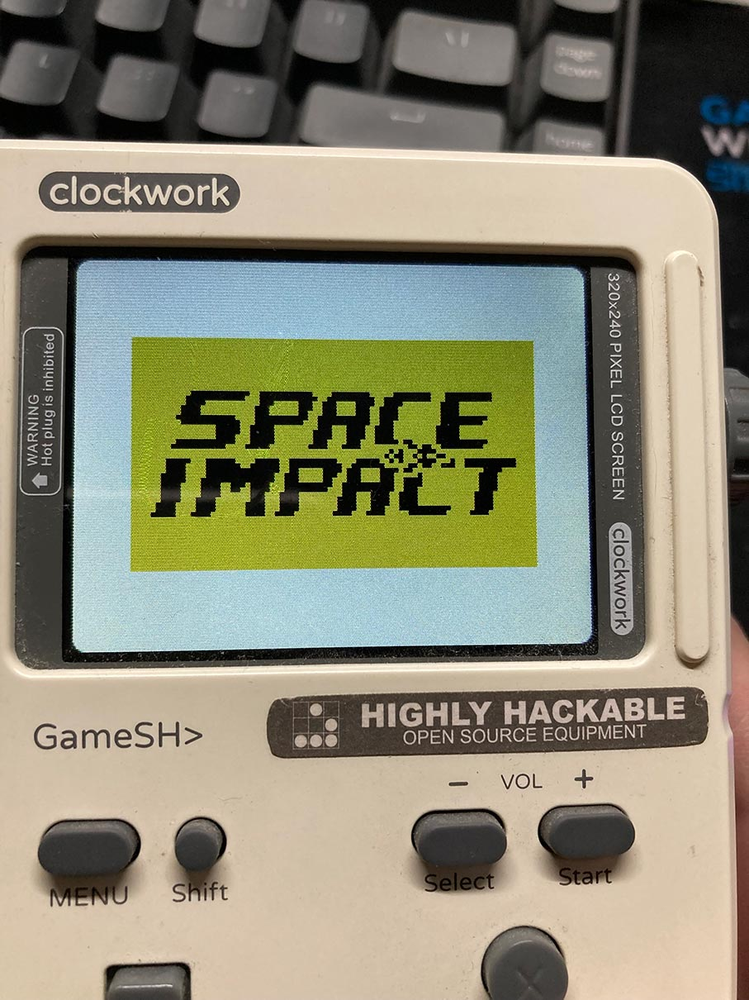
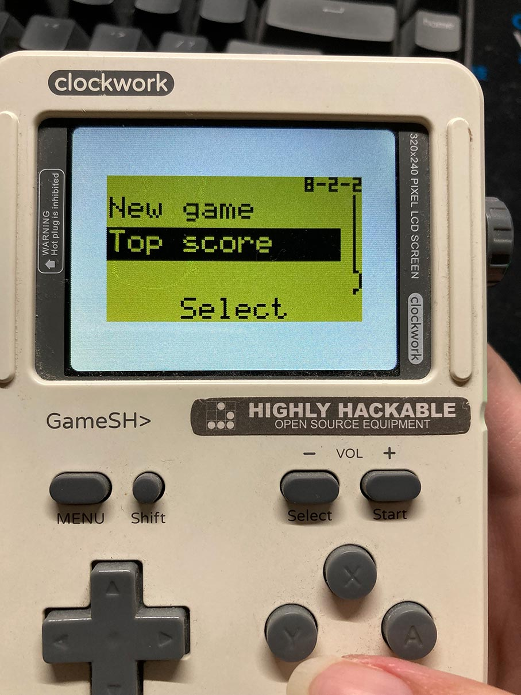
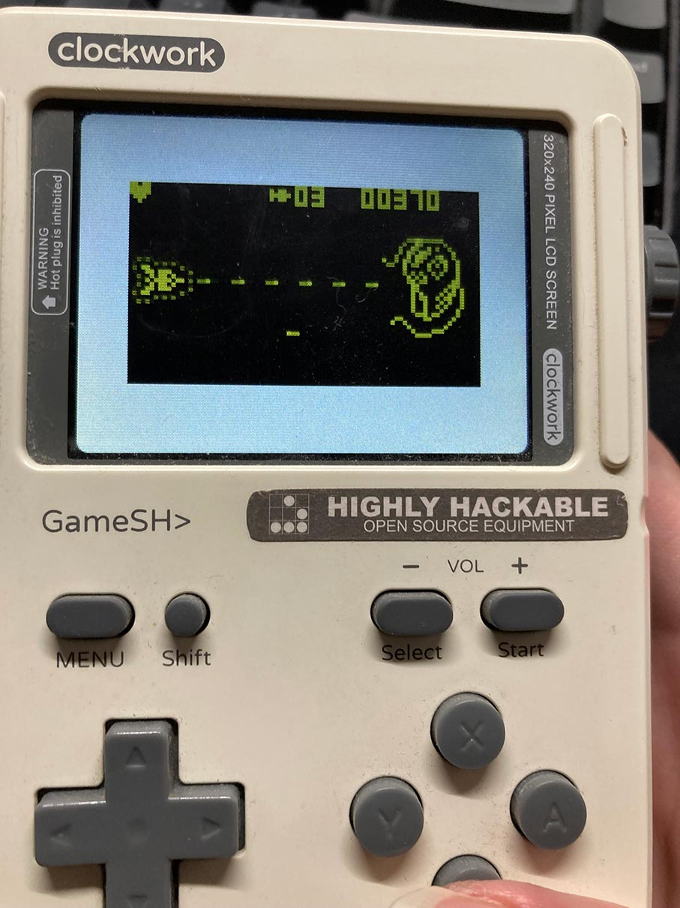
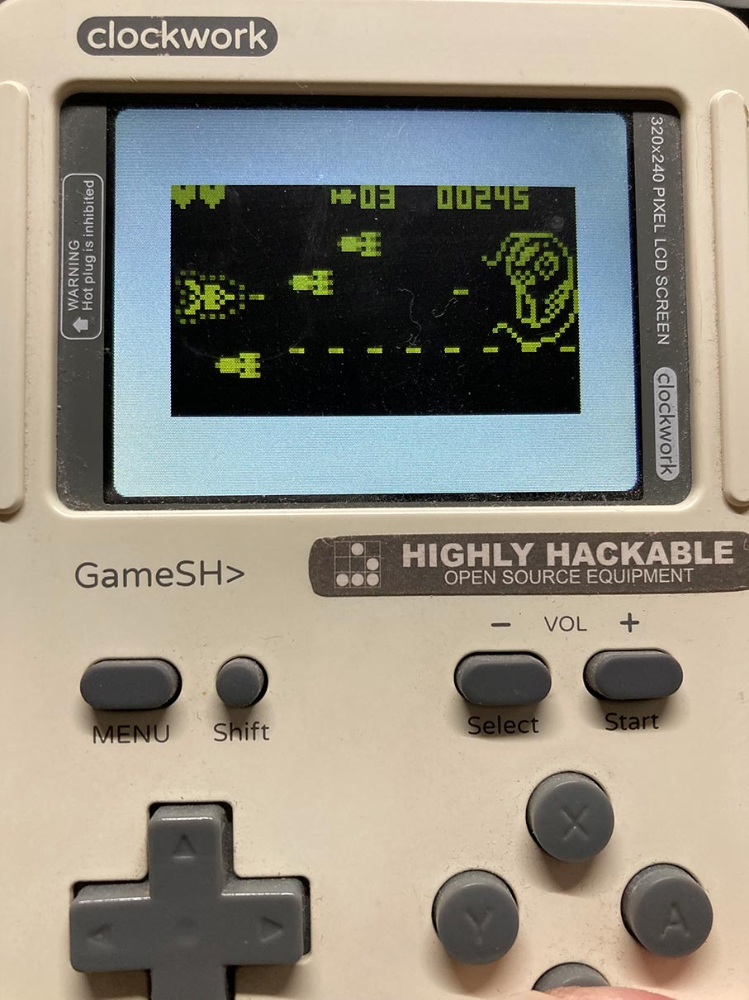
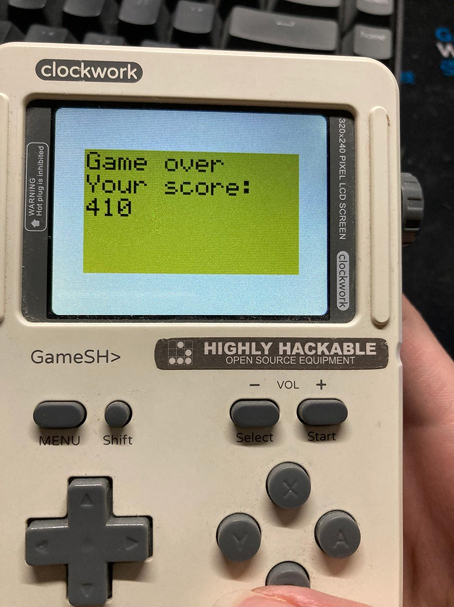

# Space-Impact-II-GameShell
Pixel-perfect clone of Nokia's Space Impact, one of the biggest classics in mobile gaming. Ported to GameShell.

## How to play
1. Download the release file, then transfer it to GameShell.
2. Unzip the release file.
3. Change diretory to XXXInstall.
4. `sudo chmod +x install.sh`
5. `./install.sh`
6. Refresh GameShell's Menu.

Keymapping:

Menu  -> Escape

A     -> Shoot

B     -> Use props

Start -> Enter

Arrow keys to move.

## Build
After SSH -> GameShell:
```bash
sudo apt-get install libsdl-gfx1.2-dev libsdl-image1.2-dev libsdl-mixer1.2-dev libsdl-ttf2.0-dev libsdl1.2-dev
git clone git@github.com:zzxzzk115/Space-Impact-II-GameShell.git
cd Space-Impact-II-GameShell
make all
```

## Screenshots












# License

This software was created only for educational purposes. The source code, just like the compiled software, is given to you for free, but without any warranty. It is not guaranteed to work, and the developer is not responsible for any damages from the use of the software. You are only allowed to use the software - or any modified version - for personal use, and you are not allowed to release any part of the code or the software in any way.
